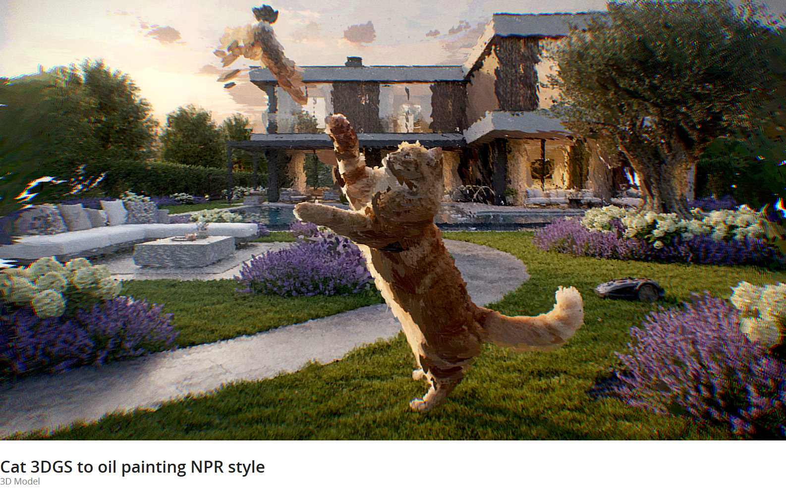
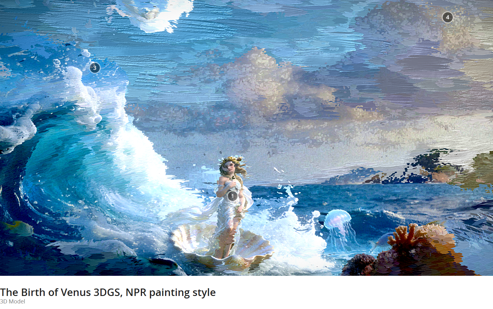
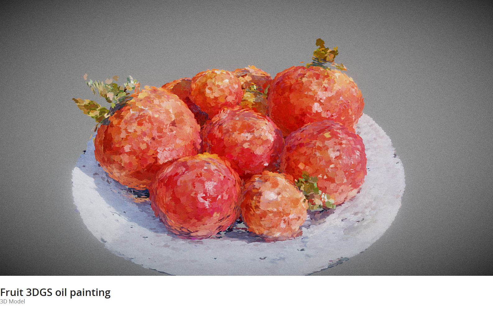
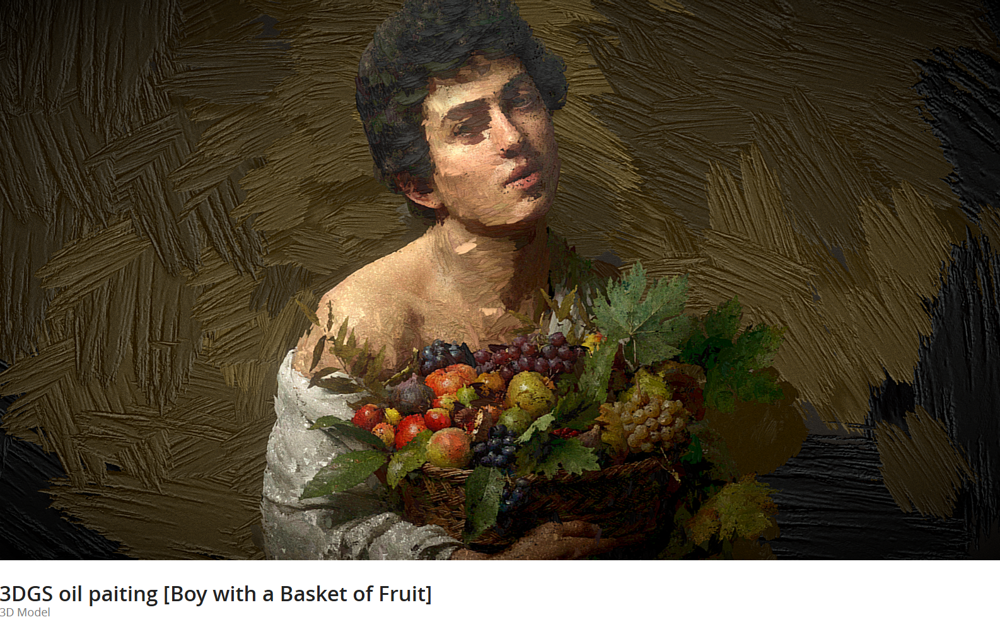
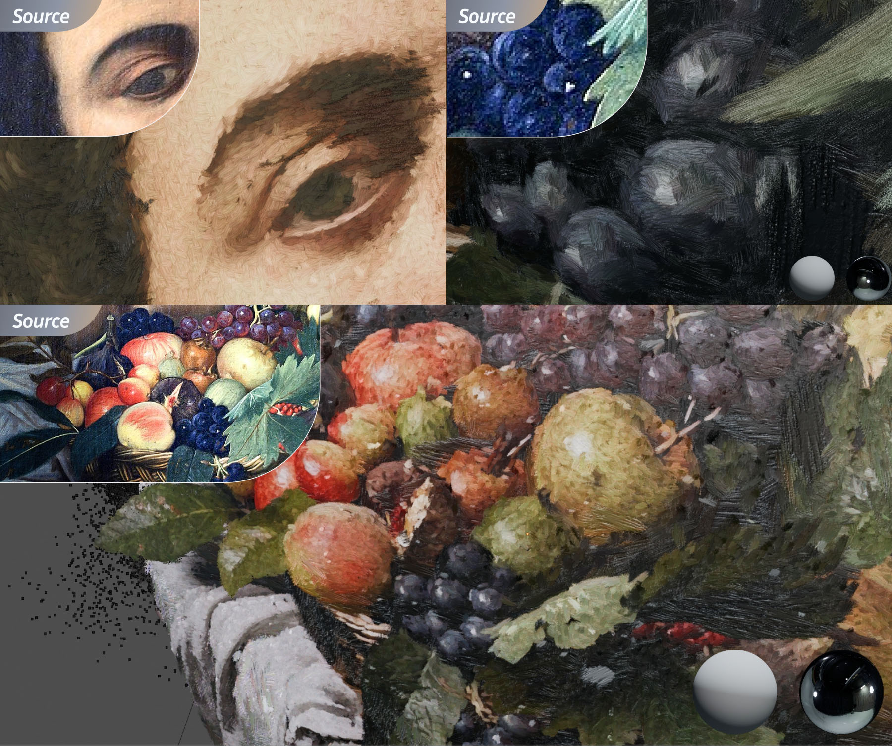

# 3DGS Oil Painting Stylizer

This Blender addon transforms 3D Gaussian Splatting (3DGS) models into stylized oil painting assets. It uses a custom **Geometry Nodes** setup and **LUT-based color baking** to create lightweight, exportable meshes that mimic brush strokes.

All calculations are optimized for performance. The final output is standard mesh geometry with baked textures, compatible with other 3D software and game engines (FBX, OBJ, GLB).

---

**3DGS 油画风格化插件**

本插件基于 Blender 开发，可将 3DGS 模型一键转化为油画风格的 3D 资产。核心利用**几何节点（Geometry Nodes）**与**LUT 颜色烘焙**技术，将复杂的点云数据重构为带有笔触质感的低模网格。

生成的模型完全是标准的 Mesh 数据，兼容性极佳，可直接导出为 FBX、OBJ 或 GLB 格式用于其他渲染引擎或游戏开发。

---

## 🖼️ Gallery / 案例展示

| | |
|:---:|:---:|
|  |  |
|  |  |

---

## 🚀 Installation / 安装

1. Download as `.zip` file.
2. Open Blender (4.2 or later).
3. Go to `Edit > Preferences > Add-ons`.
4. Click `Install...` and select the zip file.
5. Enable the addon **"3DGS Oil Paint"**.

## 🛠️ How to Use / 使用方法

The addon adds a new panel to the 3D Viewport sidebar (press `N` to toggle).

1. **Import & Bake**:
   - In the **3DGS Palette Tools** panel (`N` key), click **Load .ply**.
   - Select your `.ply` file (standard 3DGS export).
   - The addon will automatically import the points, analyze colors, bake a palette texture, and generate the mesh.

2. **Stylize**:
   - **Brush Texture**: Choose a brush alpha from the thumbnail list to change the stroke style.
   - **Properties**:
     - **Z is Minimum**: (Default On) Auto-rotates splats so the smallest scale axis aligns with Z.
     - **Y-up to Z-up**: (Default On) Rotates the final object to fix orientation issues common with photogrammetry.
     - **Source is Linear**: Check this if your PLY colors look washed out (gamma correction).

3. **Export**:
   - Once satisfied, click **Export...** to save your stylized model.
 

  

